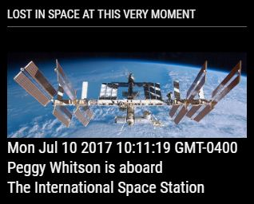
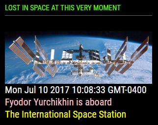

## MMM-Astronauts

Astronauts that are currently in space and the spacecraft they are on.

## This is Major Tom to Ground Control

Default is white text. Annotated .css file included for sizing and coloring.

, ,

## Installation

* `git clone https://github.com/mykle1/MMM-Astronauts` into the `~/MagicMirror/modules` directory.

* No API key needed! No Dependencies! No kidding!

## Config.js entry and options

    {
        module: 'MMM-Astronauts',
        position: 'top_left',
        config: {
			useHeader: false,                // true if you want a header      
			header: "",                      // Change in config file. useHeader must be true
			maxWidth: "300px",
			animationSpeed: 3000,            // fade speed
        }
    },
	
## Starship Trooper, go sailing on by . . .

* Shine your wings, forward to the sun.